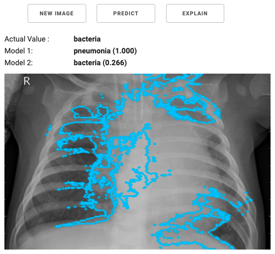

# Ch 2: Production Machine Learning Workflows

This section takes a look at the workflow that is most often applicable to enterprise machine learning projects. It is not the only implementable workflow, but it is the most common one we, as a customer facing field team, see.

## Workflow Steps 

The steps below follow the typical workflow for taking a machine learning project to production.

### **Step 1: Clarify Business Requirements**

Everything starts with a business requirement; we need to be able to predict X in order to meet business requirement Y. The source of this request can be from anywhere within the business, and it will likely come from a team or department with limited data science and machine learning capabilities. The request may not be valid or relevant to implementing a machine learning project though. To make sense as a machine learning project the request should include a requirement to predict something that is currently unknown and at least one measurable metric that can gauge the success of this project.

### **Step 2: Assess Available Data**

Once the data science team has understood and validated the project, they need to determine what data will be needed for the project. This means looking internally at what data is available, checking if it is accessible, and what gaps there might be. If additional data is needed, the data science team should work out if this data can be obtained internally or needs to be acquired from an external 3rd party.

### **Step 3: Develop the Data Science Plan**

The next step is exploratory data analysis. This is to understand the shape and structure of the data. This is also where the data science team will come up with a plan for developing a model that solves the business requirements. This is also where the initial model building, testing, experimentation and optimization comes in. The end result should be a working prototype of the machine learning model that will be deployed in the next step.

### **Step 4: Model Deployment**

The model developed in the previous step needs to be deployed into production. This means it needs to be deployed in a way that allows its output to be used by the business (or more realistically, other internal applications) for the predictive requirement. It needs to be deployed in a way that matches the availability requirements expected by the teams and internal applications that will use it.

### **Step 5: Model Operations**

The final step is the automation and continuous monitoring of the model. This will include monitoring metrics and availability of models and other parts of the end to end implementation. This is also where tasks are triggered and run to update, train and redeploy models to make sure it continues working effectively over time. This step should also include assessing when a model is no longer needed by the business. A model could still be operating effectively but there is no longer need to use it within the business and it should be shut down to get back the resources.

## Example Scenarios 

The following examples showcase complete implementations of production machine learning projects. Both examples have been implemented within the Cloudera Data Platform using the Applied Machine Learning Prototypes (AMPs) feature in CML. They can serve as useful guides for how you might implement similar projects, using your own data.

### Scenario 1: Churn Prediction 

Github link: [https://github.com/fletchjeff/COPML-1\_telco\_churn](https://github.com/fletchjeff/COPML-1\_telco\_churn)

Let’s apply this workflow to a business challenge – predicting the likelihood that a customer will churn.

Applying this workflow to the origin [telco churn prototype](https://github.com/fastforwardlabs/cml\_churn\_demo\_mlops) would yield a number of steps:

#### **Step 1: Clarify Business Requirements**

A fictitious telco business wants to predict which customers are likely to churn in order to be able to reduce the current churn rate (e.g. from 10% to 5%). In order to fulfil this objective the business needs to be able to predict the probability of any of its customers churning. Those deemed as ‘high risk’ can be entered into some sort of remediation process. For example, an offer of a free data or text package, or whatever the business has decided is the best course of action for retention.

#### **Step 2: Assess Available Data**

The data science team assesses the customer-related data that’s available in the organization’s data warehouse and any relevant data that’s been made available from other sources and confirms it is accessible to the systems the data science teams will use for EDA and model training. In this particular case, the customer-related data includes demographics information, usage data, product mix, monthly charges, total charges etc. It is important that the available data includes both customers that have left (i.e. those that have churned) as well as existing customers who have not churned.

#### **Step 3: Develop the Data Science Plan**

For this project, the plan is to build a binary classifier model that can classify a customer as a churn risk or not. This model can be applied to any existing customer. The data science team will create notebooks for conducting exploratory data analysis and for the machine learning model build.

#### **Step 4: Model Deployment**

The model needs to be deployed into the place where its output is available to the relevant teams so they can fulfil the business requirement. Our illustrative code builds a real time model that can make new churn predictions for customers on the fly. However, the more common scenario would be one implemented using a batch process. For example, a batch job might be run once a week, its output would update a table or a list that is accessed by the team that’s tasked with implementing the customer retention strategy.

#### **Step 5: Model Operations**

The model’s performance needs to be checked periodically. A good way to do this is to examine a proportion of the customers that the model made predictions for and assess the accuracy of those predictions e.g. how many of those predicted to churn actually did? Alternatively, what are the precision and recall values of the model? If the model performance falls below an acceptable level then it will be necessary to retrain the model. The performance metrics in this scenario are relatively straightforward, but even one this simple can be hard to put into production within an enterprise context. For example, the choice about how often to assess the model’s performance is very dependent on the business circumstances and the consequences of inaccurate predictions or c[oncept ](https://concept-drift.fastforwardlabs.com)drift. In the churn prediction scenario described here, while timing matters it’s not the most important thing. Churn has business implications in the medium- to long-term but its short-term impact is limited. Therefore a delay of a few days for a performance assessment would probably be acceptable.

### Scenario 2: Detecting Pneumonia in Chest X-Rays 

**Github Repo:** [https://github.com/fletchjeff/COPML-2\_xray\_classifier/](https://github.com/fletchjeff/COPML-2\_xray\_classifier/)

This computer vision challenge calls for a different approach to implementing a machine learning model. The requirements are very different from the Customer Churn scenario above. For one thing, given the health context, the risks associated with a poor or inappropriate implementation is far greater.

#### **Step 1: Clarify Business Requirements**

_Note: This example is for the sole purpose of illustrating a technical implementation and should not be considered a source of actual medical advice or opinion._

Pneumonia is a serious life-threatening condition. Its potentially devastating effects have become even clearer over the course of the Covid-19 pandemic. It has a number of causes including bacteria, viruses and fungi. The treatment for pneumonia varies depending on the cause. Consequently, it’s really important to accurately identify if the patient has pneumonia and if so, what type, so that the right course of drugs can be administered. In a busy, pressurised hospital setting, unexpected events can lead to resource constraints which in turn can lead to delays in diagnosing pneumonia. The use of a machine learning model to help with a timely diagnosis could help to save lives and reduce the burden on healthcare practitioners. A machine learning model that is capable of making high confidence predictions (that is embedded in a system with appropriate checks) has the potential to reduce costs and delays associated with blood tests and extensive consultations with specialists. Obviously, lower confidence predictions will still follow the conventional diagnostic workflow. The business requirement in this scenario is the smooth and timely prediction of likely pneumonia cases (with minimal false negatives) while reducing the number of non-pneumonia cases that are directed for blood tests and examination by consultants.

#### **Step 2: Assess Available Data**

The dataset for the model training comprises digitized x-ray images from a range of patients – some with various types of pneumonia and others with uninfected lungs\[2]. Digitized x-ray images are fairly widely used and the data format is well understood. This dataset needs to be made accessible to the data science team for model training. The sample project uploads the training image dataset to the connected data store (for CML this could be an S3 bucket). This could also be implemented using the Cloudera Operational Database (COD), as its Apache HBase Medium Object Storage (MOB) feature means it is [well-suited to serving images](https://blog.cloudera.com/introducing-apache-hbase-medium-object-storage-mob-compaction-partition-policies/).

#### **Step 3: Develop a Data Science Plan**

The next step is for the data science team to explore the dataset and come up with the plan for model development and mode of deployment. The business requirement is to reduce the time to get a diagnosis, and minimise the use of specialists and/or additional blood tests. This needs to be done with the view that the model should also make the fewest possible number of false predictions that a patient does not have pneumonia when they actually do. The model supports this requirement by minimizing false negatives as much as possible and optimizing the accuracy of the classification. A reasonable plan for achieving this would be to create an image classifier using [transfer learning](https://blog.fastforwardlabs.com/2019/09/05/transfer-learning-from-the-ground-up.html) on one of the new generation, pretrained image classifier models. So our machine learning solution will comprise two specific models: one model capable of predicting if the patient has pneumonia and a second for predicting the type of pneumonia. The first model needs to be optimized to reduce the number of false negatives (high sensitivity / recall). Adjusting the threshold for classification into either group should minimise false negatives. The second model needs to be optimized for accuracy as the requirement is for more certainty as to the type of pneumonia. This is likely a complex computation task that will require many nodes of GPU during the initial model training process and would be best implemented using a public cloud-based CML with GPU nodes for the duration of the training and optimization processes.

#### **Step 4: Model Deployment**

A production version of this model would involve a pipeline that captures new images from an x-ray that is flagged by the radiologist as requiring pneumonia identification. This image (or in some cases multiple) of the patient’s lungs would be sent to an API endpoint in CML to provide a prediction from the classifier. The data from each call to the API needs to be stored to calculate overall model performance and any result that is below an acceptable confidence threshold needs to trigger an alert to the attending medical practitioner to then either request blood test or request human assistance from someone with expertise in this field. Of critical importance here are availability and history. The model must always be available and the lineage of the data on which it was trained must be tracked in order to support auditability and reproducibility requirements. It is also necessary to store all predictions made by the specific model deployed and the detail for the image used. This allows the ability to confirm that the specific deployment will make the same prediction given the same image and to cover the Auditability requirement listed in section 4. CML provides the ability to track the image details, the prediction and a unique identifier for the model used. CML also keeps copies of previously deployed models so they can be redeployed for testing if required.

**Step 5: Model Operations**

Once the machine learning models are deployed, the classifier’s performance should be validated against human assessments and blood tests. Further, a random sample of the high confidence predictions made by the model should also be validated in this way.

In a scenario such as this, where the number of positive cases of pneumonia are low relative to the total number of people x-rayed, an[ imbalanced classification](https://machinelearningmastery.com/what-is-imbalanced-classification/) could be a complicating factor. It could result in a situation where a model appears to be making accurate predictions (and by extension, fulfilling business requirements) but in reality it’s simply reflecting statistical probabilities.

In order to better understand this point, let’s assume 1 in every 100 patients has pneumonia. This implies that 99% of x-ray images will have no indication of pneumonia. If our model simply classified every x-ray as normal (i.e. it never detects pneumonia) then most of the time the model would accurately classify x-ray images, it would be wrong in only 1% of cases. This would superficially satisfy the business success metrics as the number of cases flagged for corroboration through blood tests or manual assessment, would fall. This would in turn reduce the time and costs associated with pneumonia detection. However the real life implications of failing to identify a case of pneumonia would be very serious. Once the problem was eventually detected the project would, rightly, be considered a failure.

The scenario described above shows why it’s so important for the design and maintenance of machine learning systems in production, to go beyond simple and efficient automation. It highlights the requirement for both statistical or mathematical capabilities and deep domain understanding and experience to deliver the benefit that a well implemented production machine learning process can bring.

## Cross Functional Teams 

The reality is that this kind of workflow requires input from different teams within the business. In other words, it introduces a cross-functional team requirement:

* The **data engineering** team needs to make sure that the data is clean, up to date and available.
* The **data science** team then needs to perform data exploration and model building
* The **machine learning operations** team needs to manage the model post-deployment and make sure that it is always available, operating accurately and continually accessible to the relevant business users.

It is reasonable to expect that different parties within the cross-functional teams might have differing and strongly held opinions about how things should be done. Unless there is careful coordination, it is possible to inadvertently create the conditions for ‘The Great Circle of Blame’.

This circle of blame describes a set of behaviours and attitudes that can arise within cross-functional teams wherein blame for things going wrong is attributed to colleagues based in other teams. For example, data scientists might blame their data engineer colleagues for not providing the data in their preferred format or that is not available. Data engineers might blame the data scientists for not adhering to corporate security standards during model development. ML Ops practitioners might express frustration about data scientists not writing tests for their models and data scientists might be exasperated by ML Ops refusal to accept Notebooks as working models. The Great Circle of Blame might look different in different organisations but if left unaddressed it can be a contributory factor for machine learning models failing to make it to production. In addressing this issue, it is important to develop agreed ways of working _and_ to select a platform (and tooling) that is capable of supporting all members of the cross-functional teams to work in the agreed ways.
