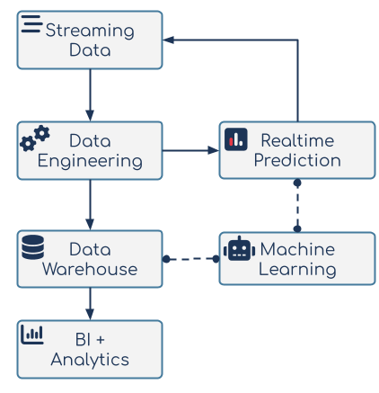

# 1: Defining Production Machine Learning

Machine learning is already an overloaded term so perhaps a good starting point for this document would be to clarify what we mean by Production Machine Learning. In our view, it is the point at which the output of a machine learning model fits into the broader business environment which is where value is realised. The term comprises the various processes and practices that enable this to happen in a consistent and sustained manner.

## Data Science vs Machine Learning vs AI

While machine learning is technically part of the data science discipline, in an enterprise context it’s often treated as its own function. This is probably because of the type of implementation demands that machine learning makes on organisations relative to other forms of data science. These demands reflect the different purposes (and resulting value) of machine learning when compared with other data science sub-disciplines.

A simple way of thinking about the differences between analytics, data science and machine learning is to consider the different types of questions they allow the business to answer. Is the requirement to use existing data to understand what has already happened or to make a prediction about the future? Machine learning enables the latter while analytics supports the former. Predicting what _could_ happen in an area which is of interest to the business, can be a very useful source of competitive advantage. However, realising this competitive advantage depends on organisations being able to incorporate these predictive insights into their business processes. Production machine learning is focused on implementing machine learning in a way that allows businesses to maximise the resulting benefits for as long as possible.

It’s also important to understand that machine learning is not and should not be considered its own island, operating independently from the other data disciplines and with its own separate infrastructure. Most enterprise production machine learning projects will use and generate data that has utility to other parts of the business (and other data science disciplines!). It’s important that production ML is implemented in a way that facilitates the ability to access, update and augment relevant data using the same platform the rest of the business uses.

Having said that, there are some additional infrastructure and platform requirements that are specific to machine learning which need to be considered. Training complex neural networks may require GPUs or specific periodic, elastic ML infrastructure that would need the auto-scaling capabilities of public cloud. Ultimately there is a lot of overlap between the data, the various data teams and the infrastructure that they use. When looking at the infrastructure requirements presented later in this document, it's worth first knowing what is available and applicable before considering bringing in something new.

## Machine Learning in Production is Hard

There is plenty of [research](https://arxiv.org/abs/2011.09926) focused on the [challenges](https://www.mckinsey.com/\~/media/mckinsey/industries/advanced%20electronics/our%20insights/how%20artificial%20intelligence%20can%20deliver%20real%20value%20to%20companies/mgi-artificial-intelligence-discussion-paper.ashx) of getting machine learning projects into production. The diagram below is taken from one such piece of research, [Hidden Technical Debt of Machine Learning systems](https://papers.nips.cc/paper/2015/file/86df7dcfd896fcaf2674f757a2463eba-Paper.pdf).

One of the key take-aways from the paper is that the development of machine learning code represents a very small part of the much bigger and complex production machine learning ecosystem. Enterprise data scientists can probably find sample models for some of the more common machine learning use cases via an internet search. These sample models will probably come with clean data (likely in the form of a zipped CSV file) and a Jupyter Notebook that implements all the code. This might provide a good basis for developing a working model. Unfortunately this will not work for real world production machine learning. All of the other parts of the data ecosystem need to be running optimally for the ML code in the middle to be useful. It is the integration of that machine learning code with the rest of the ecosystem (and the teams that run it!) that is the hard part.

This reality is often obscured by the hype surrounding data science which inflates the importance of model development relative to other parts of the ecosystem. As an example, consider a financial services institution in which an operational database breaks down, limiting the availability of transactions and transaction data to the downstream applications. This is a significantly more important issue than a break-down of an ML application which predicts which customers might churn. While model development is, understandably, very important to data science practitioners, it often does not enjoy the same degree of importance within the wider business. As a result, data scientists’ needs are not necessarily prioritised when it comes to technical decisions that may ultimately impact their work. Consequently, while they may be able to operate independently when it comes to developing a ML Proof of Concept (PoC), they may struggle to take things further. This inability to integrate the model output into the rest of the ecosystem will ultimately result in the project’s failure.
