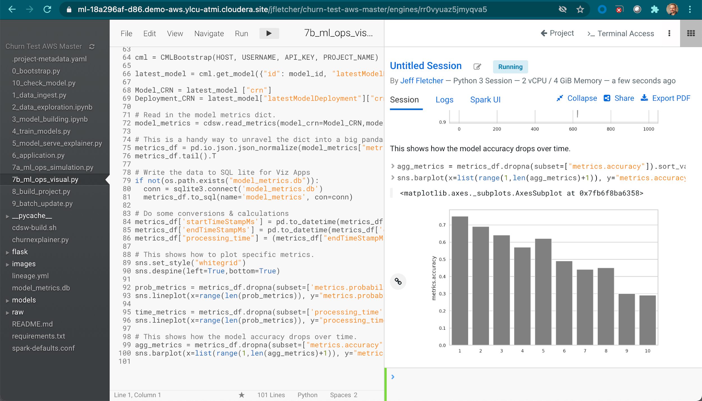
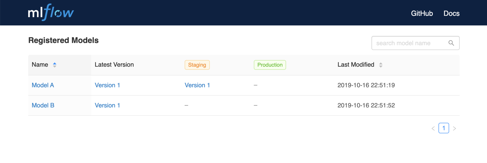

# 4: Machine Learning Infrastructure

This section highlights which aspects of your infrastructure, platform and tooling are required in order to support the cross-functional teams involved in delivering the machine learning workflow described in [chapter 2](chapter-2.md). The details provided here are include specific reference to popular (at the time of writing) open source tools. These ideas can be applied to most ML platforms or a bespoke build comprising various components from the Open Source Software (OSS) world. It’s worth noting that this latter case can present its own set of issues. This section is applicable to the workflow concept. This is different to the use of ML Pipelines, which can fit into one or more of the infrastructure categories below.

## Data Access

The starting point for all machine learning projects, after the business requirement, is data. The first thing to consider is what data is already being stored by the organisation and whether it is applicable to the project. If the available data fits the requirements, then the next consideration is how accessible it is to the people and processes that need it. However, if there are gaps in the data, then it might be necessary to acquire additional data. This can come from internal data sources which aren’t collected or stored in an accessible manner. This data could also come from an external third party provider. However the data is acquired, it will all need to be accessible to the people and processes that need it within the overall machine learning workflow.

Another point of consideration for the organisation is whether there is value in storing the products of intermediate data processing, such as features (representations of data that can be ingested by models), within a feature store.

### Feature Store
At present, there is no consensus on the term feature store or whether [you really need to use one](https://towardsdatascience.com/do-you-really-need-a-feature-store-e59e3cc666d3#:\~:text=The%20canonical%20use%20of%20a%20feature%20store\&text=are%20used%20in%20multiple%20models,always%20need%20a%20feature%20store.). In its simplest form it can be considered a store for curated features so they can be reused. In its more complex manifestation, a feature store might go beyond facilitating access to features and also seek to deliver high availability and low latency in production as well as more [complex requirements](https://eugeneyan.com/writing/feature-stores/).

In machine learning, model training requires the inputs for the model training process to be represented as numeric values. As an example, categorical variables like red, green, and blue must be transformed via a process like [one hot encoding](https://machinelearningmastery.com/why-one-hot-encode-data-in-machine-learning/). Relatedly, certain machine learning algorithms work better when numeric inputs are scaled or normalised. Scaling is the process of taking a column of numbers that ranges from, for example, 1 to 1000 and creating a new column that ranges from 0 to 1 (often referred to as normalising) or -1 to 1 (often referred to as standardising). This represents the final stage of the data preparation before it can be used in the machine learning model training process. This feature data is not necessarily useful to other users of the data platform outside of machine learning model training though.

In some machine learning implementations feature creation is incorporated into the model training process using a ‘pipeline’ i.e. an automated sequence of steps. This pipeline will create the features needed for the model training process. These features are ephemeral in nature – they are discarded once the model training process is done. However, some workflows allow these intermediate features to be more permanent by storing them in a feature store. There can be benefits to doing this. For example it can help save on the compute resources required or speed up the process of hyperparameter optimization by removing the need to recalculate the extracted features for each model training run. Feature stores can also help with reproducibility. We’ll cover this in a bit more detail later in this white paper.

From a data engineering perspective, Data Access is primarily focused on making data accessible by the data science and ML Ops teams. The data needs to be clean and as up to date as is necessary to meet the business requirement. This data could be in the form of files on a local file system or a cloud object store, or it could be structured data that lives in an Data Warehouse

The decision about what to use depends on the particular machine learning project and the data used for it. It can be tabular data, or document-like key-value data, or binary data like images and audio files. Keeping data within the stack minimises the complexity of security and governance of moving data between disparate systems.

Putting extracted features into a feature store raises the question of responsibility. There are no hard and fast rules about this. Our advice is that the relevant teams - data engineering, data science or model operations- decide how responsibility is allocated based on relevant skills and knowledge. 

There are tools that are specific to providing feature store capabilities like [Feast](http://feast.dev/) and [Tecton](https://www.tecton.ai/), alternatively you can co-opt your existing Data Warehouse to store features as required. 

## Data Exploration

Exploratory data analysis (EDA) is a fairly well understood function within the data science community. There are well established tools like [Jupyter Lab](https://jupyter.org/) and [R Studio](https://www.rstudio.com/products/rstudio/#rstudio-desktop) that provide comprehensive EDA capabilities.

It is at this stage that the data science team will look at the ‘shape’ of the data and come up with a plan for building a suitable model. EDA is often combined with the Model Building stage, however this doesn’t mean a single team necessarily manages the entire process. It may be that there are good organizational reasons to split this activity, for example to accommodate areas of specialization. Some personnel may be more inclined towards statistical data analysis and so focus on EDA while others might specialise in model optimization and concentrate on that part of the model development process.

What is most important is that at this stage the data science team should have easy access to all the relevant data and have the flexibility to augment that data (if necessary) in order to best serve the business requirement.

### Source Control

One of the main parts of the artifacts created during the various stages of deploying a machine learning project is the actual code written by the data scientists and machine learning engineers. Creating code usually starts once Data Exploration starts, but there may be some code that is used to facilitate or create data that is needed for data access. These code artifacts need to be persisted and stored and have the ability to keep track of a history of changes. This is required for the auditability and regulatory requirements discussed in [chapter 5](/chapter-5/#regulatory-requirements), but also for the developers to be able to collaborate effectively and roll back if any changes are made that cause issues with the project. This is where source control comes into play. Like any other form of software development, not all changes to code are significant, but anything that is considered significant or just as a way to store the current state of the code and other software artifacts, source control tools are invaluable.

Source control systems are a solved problem, with many feature rich, tried and tested tools available. Most data science and machine learning tools will have integrations with any git compliant source control system: Github, Gitlab, Bitbucket etc. Some source control systems have workflow automation tools built in that can integrate with the APIs from other tooling you have chosen.

The main thing to keep in mind is that source control is used to store the code. It can be used to store other artifacts, like saved model files or data sets, but it's not designed for that. Source control systems should be used as part of the overall platform to manage version control for software code.

## Model Building

Model Building encompasses creating the first versions of the model that will be deployed into production. This will usually cover Feature Generation and the first few iterations of model training. This also also includes the standard machine learning processes of model evaluation and optimisation, but it does not always need to include those steps. While model building is often done in conjunction with the previous step of Data Exploration, bigger teams might support some degree of specialisations of roles. Some team members will focus on implementing the best approach to addressing the business use case while others might concentrate on model selection and optimization. For the sake of clarity, let's confirm what is meant by a **model** here. The code used to create the model will likely include a current set of optimizations and hyper parameters specific to the model. This code and any iterations used to create a new version of the model that contains changes to the way the model be trained should be checked into the source control system.

### What is a model?

The term model has many uses within different contexts and its meaning can change even within the data science context. For the purpose of this document a model is:

> A combination of a data transformer, an algorithm and configuration details that can be used to make a new prediction based on new data.

Regardless of whether this is implemented as a single step, a couple of steps that involve getting the transformed data to and from a feature store, or an activity within a pipeline, the definition still holds. The final form of the model is an artifact.

### Model Formats

The final trained model artifact is a file that can be loaded at a later date and be used to make new predictions. This file can exist in a variety of formats, from serialised files like a [Python Pickle](https://docs.python.org/3/library/pickle.html) or a [POJO](https://docs.h2o.ai/h2o/latest-stable/h2o-docs/productionizing.html#about-pojo-mojo) if you're using H2O. There are many model format options available, a good place to find the most commonly support formats is in the list supported by [MLFlow](https://www.mlflow.org/docs/latest/models.html#built-in-model-flavors)

### Model Optimisation

The initial model building process incorporates some work towards improving model performance through hyperparameter optimization and some exploration of different approaches to feature creation. MLFlow is one of the more commonly used tools of model optimisation, along with other OSS tools such as TPOT, auto-sklearn, MLFlow etc. A common standard approach to building machine learning models involves evaluating a models performance against test or validation datasets and optimising for algorithm selection, feature generation and hyperparameter tuning. A model can be built using all or none of these, or using an automated process to that will do this for you. 

AutoML and other automated hyperparameter optimization tools are useful but should be considered in light of available compute resources and machine learning skills. A data scientist with enough experience and domain expertise will probably know what to do to get to an optimized model more quickly and cheaply than an AutoML tool would. For many use cases an AutoML tool is no replacement for an experienced data scientist, who will be able to develop a more effective and interpretable model. Consequently, it should not necessarily be included as part of the process for all new models if it doesn’t need to be.

It is also worth considering if it is possible to use some off-the shelf model or service to use to make predictions rather than going through the process of training your own model. For use cases that are based ib natural language processing or computer vision, especially if its based on commonly used data, the services or prebuilt models available will very likely be better than anything an enterprise can create. For cases where the data is a bit more specific to your use case, then applying transfer learning to an existing model would still be better than training a model from scratch. 

The infrastructure needed for doing model building and training is another point of consideration. The next section explores this further but it’s worth noting even during the early stages of model building, model optimization will require several iterations of model training. The type of model, the size of the data and available compute resources will dictate what kind of infrastructure is most suitable for running the model training process. For example, training a big neural network on a very large dataset will require multiple GPU nodes to complete in a reasonable amount of time, but this is expensive infrastructure. In this situation, training needs would be better fulfilled using the public cloud to take advantage of its ability to autoscale the number of nodes required to meet the compute demand. If this were a smaller model training process or public cloud was not available, then using an existing on-premise infrastructure will suffice.

Once the initial model build is complete and there is a working process for training the model, this needs to be automated so that the model can be periodically re-trained without direct input from the data science team.

## Model Training

As part of the ongoing production machine learning workflow, the machine learning models will need to be periodically retrained. This may be because new data becomes available, the data landscape changes or a newer version of the algorithm is released that optimizes some part of the model's performance. Having the right infrastructure becomes more important here as this often needs to happen without direct involvement from the data science teams. The machine learning operations team needs a way to run a model training process directly on the available data. This may include a pipeline that does feature creation as part of the model training, or separate processes that put the features into a feature store first. Where the model training jobs sit will depend on the use case.

These model training jobs need to be automated in a way that they can be triggered through the monitoring system (discussed later in the document). The requirement is that model training jobs are schedulable and triggerable through an API call from a process running as part of the ongoing model monitoring system. This can be done using an orchestration and scheduling tool like [Apache Airflow](https://airflow.apache.org/) or an ML Pipeline deployment tool like [Kubeflow](https://www.kubeflow.org/). Using a public cloud providers implementation of Kubernetes to scale up and down the resources that are available for model training would be ideal. This allows it to support model training jobs that need a lot of capacity for a short period of time.

A hybrid cloud approach would probably provide the optimal price to performance ratio for organisations that need to manage model training for a variety of models with a range of infrastructure requirements. Having said that, there are still complexities around data locality and its impact on efficient data access that need to be understood and managed. 

<!-- The economics of hybrid cloud machine learning is discussed in further detail [here] 
** TODO - write this -->

## Deploy and Serve

The trained model now needs to go into **production** i.e. the model’s output needs to be 'served' to or integrated into downstream applications. Depending on the availability requirements discussed in [chapter 5](chapter-5.md), some organisations run completely separate environments to differentiate between development and production systems. Once a model has been developed and tested on the development system, it is moved on to the production system for deployment. This allows for different architectures and configurations between the two platform types to meet differing compute and availability requirements. These kinds of development to production workflows are traditionally implemented using an a CI/CD process backed by a tool like git/Github.

The infrastructure that will be used to host the deployed models can be existing, preconfigured compute or dynamically created using Kubernetes or similar virtual environments. The CI/CD process can create or use existing infrastructure and split it into development and production through source control.

The two main modes of operation for production machine learning models are **batch** and **near realtime**. There are other modes of operation for machine learning models, but they are far less common.

### Batch Models

A batch process runs periodically and will make several inferences at a time. It might be a process that runs batch inference on tabular data and adds or updates a column with predictions made by the model. The process would be to periodically trigger a script or process that can fetch new data from and update the relevant datastore with a new prediction. The served model in this case would just be the model artefact loaded from a file and used to make predictions against new data sources. These batch models can be implemented using an orchestration tool like [Apache Airflow](https://airflow.apache.org/) for scheduling and trigger the script and a tool like [scikit-learn](https://scikit-learn.org/stable/) to do inference. For much larger datasets that don't fit into the memory of single machine, it would make sense to look at distrubted computing tools that have machine learning model capabilities like [Apache Spark](https://spark.apache.org/) or [Dask](https://dask.org). 

### Realtime Models

Realtime models’ output are usually made available via APIs that can be called by downstream relevant applications in order to make new predictions on an ad hoc basis. This is the default mode for model serving tools like [BentoML](https://github.com/bentoml/BentoML) and [Seldon](https://github.com/SeldonIO/seldon-core). [MLFlow](https://www.mlflow.org/docs/latest/models.html)'s model feature provides for both batch and realtime model deployment. The model artifact (i.e. the model file) is loaded as a Python function which is then wrapped in a process that creates an API endpoint which can accept JSON as input data, run the model code to create a prediction and then return the prediction as JSON via that same API endpoint. This process is usually referred to as model serving.

Model deployment and serving infrastructure have specific availability and reproducibility requirements. These are detailed in the section on continuous operations for production machine learning.

### Model Registry

A Model Registry is a mechanism that tracks and manages models, model artifacts and related to metadata for any deployed model type. MLFlow also provides a [Model Registry](https://www.mlflow.org/docs/latest/model-registry.html) function that can provide fairly comprehensive capabilities.

## Monitoring Systems

The final stage in this machine learning workflow supports the monitoring of the model. This aim is to ensure that the model output is of a consistent performance level and reliably available to the downstream applications that need to consume it, as per the business requirement. The monitoring-related tasks should be automated and delivered with the aid of optimized tooling and infrastructure. Whatever infrastructure was used to deploy the model, it should provide the ability to check and monitor the real-time model to ensure it's up and working. In kubernetes, this is usually done using prometheus.

Separate to the infrastructure monitoring requirements, there is also the need to track the metrics from any predictions made by the model. Tools like [Evidently AI](https://evidentlyai.com/) allows the model operations team to record any number of relevant metrics each time the model is called. These metrics can be updated to include real-world data for supervised learning models and the periodic addition of aggregate metrics to track any required statistical performance metrics over time.

As will be discussed later, it’s important to know how the model is performing against both the statistical and business requirements. When monitoring a model, many implementations will focus on the statistical metrics and how these vary over time. However, this is insufficient. Many projects fail because the business requirements they were designed to deliver aren’t being met . Take for example the churn example accompanying this report, the fact that the model is 95% accurate at predicting churn is not useful if this doesn’t translate to measurable reduction in actual churn rate. It’s achieving the latter –the business requirement – that actually delivers value to the business.

As illustrated in the churn project, the model metrics are updated during the batch process, but if model metric tracking is not required, it’s possible to just update the table on each new batch run.

All of the above requirements can often be implemented using and end-to-end provide like Amazon's [SageMaker](https://aws.amazon.com/sagemaker/) or Cloudera's [CDP](https://www.cloudera.com/products/cloudera-data-platform.html). It is possible to build an implementation using open source components provided the data security and governance requirements can be fulfilled too. While these two criteria don’t have a direct impact on model performance, they are important concerns for an IT department; it will also result in fewer integration issues down the line. An end-to-end ML solution that lacks robust data security and governance is unlikely to be accepted by an enterprise IT department.
